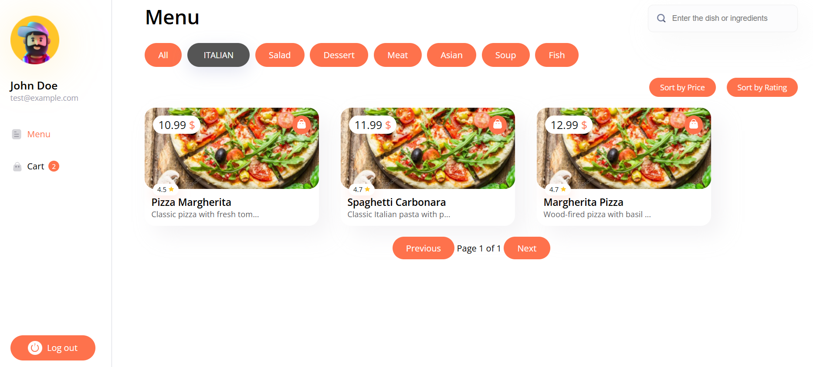
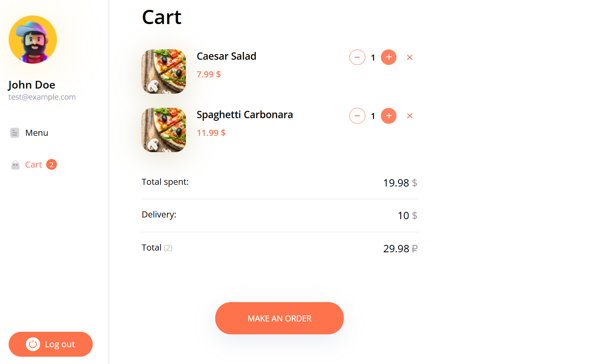
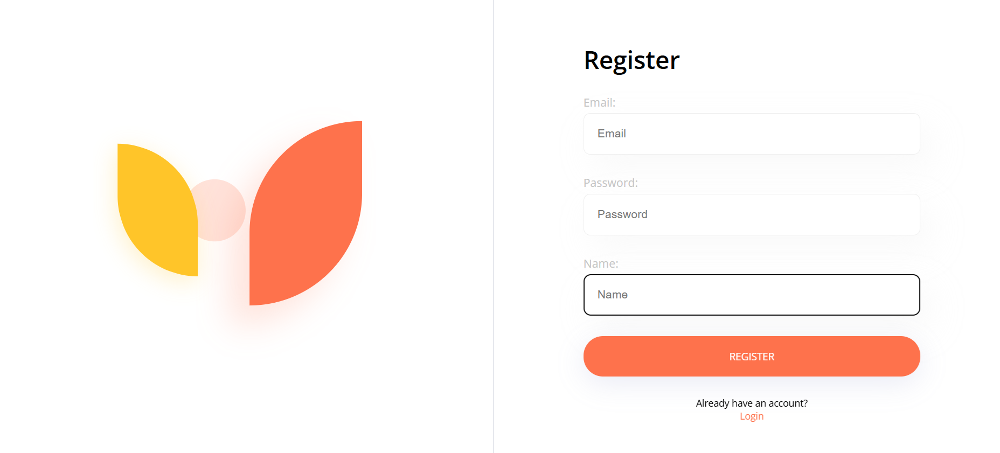
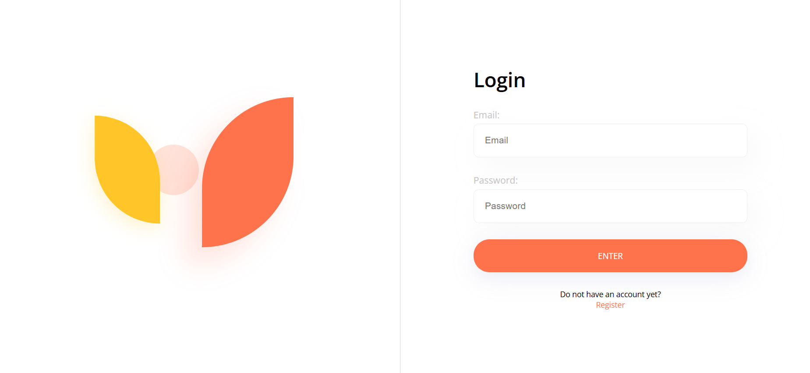

# Overview

This is a React project built Redux, and TypeScript, allowing users to browse a menu of delicious dishes, add items to their cart, and complete their order. The app is designed with a modern UI, category-based filtering, and a seamless user experience.

## 🛠️ Tech Stack

- **Frontend**: React (TypeScript)

- **State Management**: Redux Toolkit

- **Routing**: React Router

- **Forms**: React Hook Form

- **Testing**: Vitest, Testing Library

- **Mocking**: MSW (Mock Service Worker)

- **Analytics**: Google Analytics 4 (GA4)

- **Bundler**: Vite

- **Styling**: CSS Modules

## 🚀 Features

*1️⃣ Authentication*

**Login & Registration**: Users can create an account and log in.

**Protected Routes**: Access to the cart and checkout pages is restricted to logged-in users.

*2️⃣ Menu Page*

**Category Filtering**: Users can filter items by categories (e.g., Italian, Salad, Dessert, etc.).

**Search Bar**: Enables users to find dishes by name or ingredients.

**Sorting**: Users can sort items by price or rating.

**Pagination**: Ensures smooth navigation when browsing the menu.

*3️⃣ Cart Page*

**Add/Remove Items**: Users can increase, decrease, or remove items from the cart.

**Cart Summary**: Displays total price and delivery fee.

**Checkout**: Users can place an order.

*4️⃣ Order Success Page*

**Confirmation Message**: Displays order confirmation with an option to place a new order.

*5️⃣ Google Analytics 4 (GA4) Integration*

Tracks page views, cart interactions, and checkout process.

## 📷 Screenshots

### 🏠 Home/Menu Page

### 🛒 Cart Page

### 🔐 Register Page

### 🔑 Login Page

## 🔧 Installation & Setup

### Install Dependencies
`npm install  # or yarn install`

### Run the Development Server 
`npm run dev  # or yarn dev`

## Build for Production
`npm run build`

### Running Tests
`npm run test`
